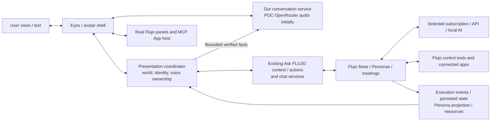

# Flujo: a world inhabited by your agents

2 October 2026 · source-grounded interface proposal

Flujo keeps its backend, APIs, UI, models, tools, flows, automations, and persistent-agent runtime. The new interface turns those capabilities into a place where the user interacts with characters. White eyes greet them in darkness, help them connect an existing AI subscription or another work model, and accompany them into a world that grows from actual Flujo state.

This proposal follows [the capability audit](FLUJO_CAPABILITIES.md) and [the connection discovery plan](CONNECTION_DISCOVERY.md). Those documents distinguish current capabilities from missing integration work.

Implementation status: the optional `/world` experience is now built in [Flujo PR #560](https://github.com/mario-andreschak/FLUJO/pull/560). This document preserves the original vision and its acceptance scope. Current implementation and runtime evidence are recorded in [the build log](BUILD_LOG.md); human microphone acceptance remains pending.

## The core experience

**The eyes are the guide.** They have a voice immediately through our conversation service. They notice, listen, ask short questions, show where to act, and remain recognizable across the world. They are there before the user has a model configured.

English is the primary language for the interface and conversation. Spanish and Brazilian Portuguese remain available as deliberate user choices.

**The user's AI does the thinking and work.** Most users should be able to start with their existing Codex or Claude subscription. Detect candidates and offer usable options first; API and local-model paths remain available. That connection does not need native voice support.

**Flujo's existing agents and Personas do the execution.** A saved Flow agent can appear as a character. A persistent Persona can become a resident with its real mission, memory, goals, behaviors, and apps. The visual identity does not create another task or memory runtime.

**The world reflects what exists and what happens.** A place has a purpose, a working mechanism corresponds to a real automation, and a result object opens a real artifact. The user can speak or use text, interact with a character or object, and open the real Flujo/app surface for precise control.

## First five minutes

1. **Awaken.** Black screen; two white eyes blink and attend to the user. A gesture begins conversation/microphone admission. Text is available immediately. “Hi. Let’s see which AI you can use here.”
2. **Discover.** The shell inspects saved connections and supported runtime/login metadata on the Flujo host. It offers detected Codex/Claude candidates, local models, and other AI connections. “Codex detected” and “verified for Flujo” remain distinct.
3. **Connect.** The user chooses an option. Existing AI Setup controls appear within the scene for login/token/key entry or model selection. Our voice explains the process using safe setup facts. In the current adapters, Codex can reuse compatible file-backed login; Claude uses its saved OAuth token.
4. **Verify.** Reuse Flujo's model test, including its production diagnostic tool round-trip. Resolve a valid model binding for the bundled FLUJO agent or an existing quick-chat/copilot path. A saved model alone does not count as work readiness.
5. **Begin.** The first stretch of the world appears. “What would you like to do?” The selected Flujo model uses real capability discovery, authoring, and tools to help. The user should not have to recreate the shipped browser, filesystem, bash, and Flujo connections.
6. **Leave a result.** A real response or artifact appears. Its place/object stays associated with the workspace and can be revisited. Setup failure keeps the eyes, guidance, and editable draft available.

The work-model choice becomes the preferred connection for new avatar-initiated work in that workspace. Existing authored bindings win. Advanced flows can keep multiple models; subscription setup should not flatten Flujo's composition capabilities.

## A world that already has a vocabulary

Flujo's modern theme already contains the **Living Watershed**, with a route-driven renderer and authored landmarks. Use that as the starting spatial vocabulary and evaluate whether the POC worlds become areas within it. The opening can reveal the watershed gradually from monochrome darkness.

| Place | Existing Flujo capability | New interaction |
| --- | --- | --- |
| Headwater Springs | AI Setup and saved model connections | Eyes detect, connect, verify, and explain work-brain choices |
| Connector Harbor | MCP connections, tools, resources, prompts, Apps | Guide connection; open real hosted apps; show verified availability |
| Flowwright Workshop | Guided/Advanced flows, generation, compiler, versions | Build, explain, inspect, revise, and run actual agents |
| Conversation Cove | Chat, quick-chat, execution and recovery | Speak naturally; inspect work; steer or explicitly stop |
| Lockworks / Wave Observatory | Automations, triggers, Waves, Automation Map | Give routines visible mechanisms and real dependencies |
| Riverside Market | Packages and registry | Add useful bundles through existing installation workflows |
| Resident places (new) | Experimental Personas and Roles | Talk to a persistent Persona; inspect its memory, goals, and abilities |
| Gathering place (new) | Meetings with Flow/Persona participants | Bring real agents together and show actual rounds/results |
| Archive / artifact objects | Resources, history, versions, tickets | Revisit outputs, pending human work, and provenance |
| Control House | Workspace, encryption, runtime and appearance settings | Let the guide explain and open precise owner controls |

The current world follows routes behind conventional panels. The new work is making characters the primary interaction and making the world evolve from resources and execution. Avoid turning every control into an obscure spatial puzzle: asking the guide should remain the fastest way to find something.

## Characters: style and identity

Start with charcoal space, chalk-white eyes, expressive gaze/blinks, soft grain, subtle light, and authored environmental motion. Keep the opening visually simple. Color and cinematic assets can emerge later.

Moss, Orbit, and Spark retain the POC's patient, measured, and energetic paces. They are useful **presentation styles**. A real backend agent/Persona is a separate **operational identity**. The selected style can change without changing the job; switching to another actual Persona deliberately changes whose mission, memory, abilities, and tasks are addressed.

Keep the eyes recognizable across the styles. Offer pace gently and let the user choose. A playful character still speaks accurate results and respects “slow down.” Scene transitions wait while the user reads, enters credentials, or reviews a result.

Several agents can work, but one active conversational speaker should keep the experience intelligible. A backend meeting may produce several contributions; the voice lane presents them with clear attribution instead of assuming several concurrent native voice sessions.

## Architecture: one voice, many work capabilities

**Conversation lane:** listening, short interaction, pacing, interruptions, and spoken presentation. It works before a user work model exists. Initial setup follows a bounded setup state machine. After setup, substantive decisions and configuration assistance go through the selected Flujo model. Keep the accepted native audio adapter replaceable.

**Work lane:** the existing flow/Persona/meeting runtime, with the user's chosen model and deliberately exposed tools. Reuse `mcp-flujo` building-block discovery, semantic flow authoring/validation, app research/install, automation operations, and Persona composition where available. The bundled agent's initial tool allowlist is narrower than the full control surface; expose additional abilities through real configuration.

**Presentation coordinator:** determines which agent/Persona the user addresses, correlates results with the workspace/conversation/activity, manages live voice ownership, and maps actual events to scenes. It is an interaction adapter, not a second execution engine, planner, memory store, or scheduler.

Reuse Ask FLUJO's page-owned context, advertised editable/highlight targets, and scope validation. Extend page registrations for Persona, automation, meeting, and connection surfaces as needed. Preserve the existing Apply behavior for proposed UI edits and existing execution/installation controls.

## Truthful interaction at two speeds

The avatar stays responsive while work runs. It can say “I'm checking” from verified state, answer “what are you doing?”, or remain quietly present. It does not invent progress to keep the scene moving.

| User action | Existing operation / meaning |
| --- | --- |
| Speak over the avatar | Stop current speech; backend work may continue |
| Amend an active request | Use existing conversation injection/steering where supported |
| Stop ordinary flow work | Invoke conversation cancellation and reflect its acknowledged state |
| Pause/stop a Persona goal | Use that goal/dispatcher's actual control |
| Ask for details | Open the actual run, flow, app, memory, or artifact surface |
| Change speaking style | Preserve execution identity and task |
| Address another resident | Explicitly select its real Persona/agent identity |
| Refresh/reconnect | Reconcile persisted state and sequence before presenting/resuming work |

Use existing durable execution events such as `run:start`, `tool:call`, `tool:progress`, `tool:result`, `run:awaiting_approval`, `resource:write`, and `run:done`. Validate their payload/status rather than treating the name alone as success. Retain conversation sequences and child-lane identity. Persona rendering can extend the existing passive runtime-presentation projection with an appropriate API/subscription boundary; that cinematic endpoint does not yet exist.

A model connection activates a spring. An app connection opens a usable place. A saved flow supplies a workshop object. A Persona has a home and inspectable memory/goal surfaces. A running job causes local activity. A resource becomes an object linked to its real identifier. A failure pauses work and offers existing recovery instead of erasing the world. Ambient life can continue independently.

## Real UI within the world

Prefer an optional same-origin Flujo experience so existing frontend services, workspace context, owner controls, and hosted Apps remain useful. A proposed route like `/world` is an implementation option, not an existing avatar route.

Frame real HTML panels in a pool, workbench, or console. Keep them readable, keyboard-accessible, and persistent while needed. Reuse the global MCP App host instead of recreating/unmounting app frames when the camera moves. Ordinary Flujo panels and sandboxed third-party MCP Apps have different boundaries.

Use APIs/tools for configuration whenever they express the operation properly. Use visible UI actions for actual app workflows and precise owner interaction. An animated cursor is feedback for a real action, not evidence by itself.

A separately hosted shell would need an explicit integration contract. Do not expose Flujo's whole administration surface or copy the Savia-specific proxy. Verify framing policy and validate message origin/source if a bridge is required. [Framing reference](https://developer.mozilla.org/en-US/docs/Web/HTTP/Reference/Headers/Content-Security-Policy/frame-ancestors), [messaging reference](https://developer.mozilla.org/en-US/docs/Web/API/Window/postMessage).

## What transfers from the POC

Transfer native audio capture/playback, cancellation, session ownership, locale handling, captions/text fallback, ambience, scene direction, and lessons from reconnect/result races. Keep the original POC and its Savia adapter intact while extracting a generic presentation/voice boundary.

Replace the bank-specific work bridge and intent assumptions with existing Flujo agent, context/action, resource, and execution contracts. Keep banking policy and Savia integration in the hackathon application.

The accepted POC path sends completed utterances to `openai/gpt-audio` through OpenRouter and streams native speech. It is not a persistent continuous-input Live transport. Most Codex/Claude work connections need no audio capability; our service supplies that separately. [Current OpenRouter audio documentation](https://openrouter.ai/docs/guides/overview/multimodal/audio).

Only bounded context and presentation facts should go to our voice service. Provider credentials, full raw tool results, private memory stores, and unrelated files should not enter voice context by default. Service hosting, admission/billing, and retention remain product decisions for rollout.

## Implementation sequence

1. **Capability audit and connection design — delivered.** Establish actual backend contracts before choosing the final UI.
2. **Source-grounded concept review.** Explore the eyes, subscription option states, watershed evolution, existing app surfaces, and the distinction between style and real agent identity.
3. **Connection discovery.** Add/refactor a generic secret-free host readiness projection. Reuse existing setup and model tests; cover both subscription adapters, saved connections, and local inference.
4. **First integrated journey.** Eyes speak through our service → user chooses a detected/other connection → real setup/test → reuse/bind bundled agent or copilot path → actual task/result → reload reconciliation.
5. **Capability parity.** Conversational flow authoring and app setup; real execution controls/resources; automation representation; optional Persona residents and meetings using their own runtime.
6. **Default-interface decision.** Consider a default avatar entry after the necessary setup, capability access, recovery, and accessibility journeys work.

The first integration should prove one verified subscription path and its actual work result, while retaining explicit alternatives. The detector must handle both Codex and Claude correctly; this does not require implementing two new work engines.

Acceptance includes: voice before a work connection; truthful candidate detection on the Flujo host; both-subscription choice; failed login/test recovery; real model/tool verification; reuse of existing capabilities; no overwritten authored bindings; accurate task identity/results; speech interruption versus work steering/cancellation; reconnect without duplicate execution; workspace isolation; text/keyboard/reduced motion; English as the primary language, with natural Spanish and Brazilian Portuguese behavior when selected.

Use bounded built/static previews for design review. The POC previously had a runaway development watcher; its paused stack does not need to be restarted to plan this integration.

## Remaining design decisions

- Which existing agent/copilot is the default work identity after setup, and when should the guide help create a persistent Persona?
- How should a style such as Moss or Spark map to a particular resident without conflating the two?
- Which worlds become watershed regions, and which capabilities need a precise embedded panel first?
- How will the hosted conversation service be admitted/billed, and which transcript/presentation facts will it retain?

These are decisions to evaluate against the audited capabilities, not prerequisites for finishing the planning artifacts.

The original POC remains intact. Implementation proceeds in the isolated Flujo worktree and this public avatar repository; the original Flujo checkout's pre-existing changes are preserved. Default-interface rollout, hosted-service admission/billing and retention remain product decisions.
